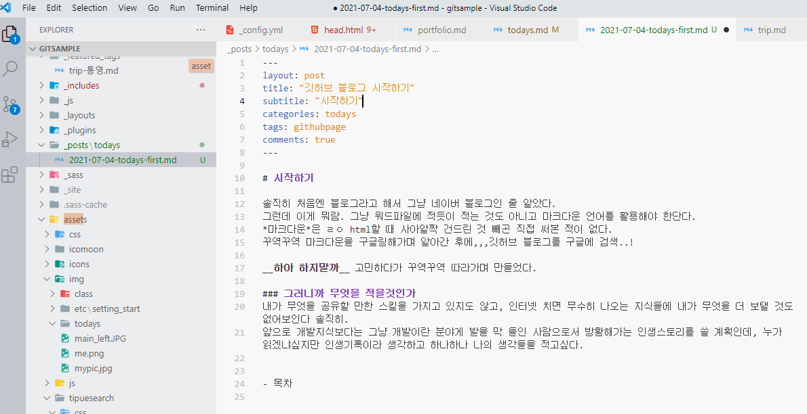

# 시작하기

솔직히 처음엔 블로그라고 해서 그냥 네이버 블로그인 줄 알았다.  
그런데 이게 뭐람. 그냥 워드파일에 적듯이 적는 것도 아니고 마크다운 언어를 활용해야 한단다.  
*마크다운*은 ㄹㅇ html할 때 사아알짝 건드린 것 빼곤 직접 써본 적이 없다.  
꾸역꾸역 마크다운을 구글링해가며 알아간 후에,,,깃허브 블로그를 구글에 검색..!

_누가 이렇게 블로그를 힘들게 만드는 거라 생각하냐고_

**하아 하지말까** 고민하다가 꾸역꾸역 따라가며 만들었다.

### 그러니까 무엇을 적을것인가

내가 무엇을 공유할 만한 스킬을 가지고 있지도 않고, 인터넷 치면 무수히 나오는 지식들에 내가 무엇을 더 보탤 것도 없어보인다 솔직히.
앞으로 개발지식보다는 그냥 개발이란 분야게 발을 막 들인 사람으로서 방황해가는 인생스토리를 쓸 계획인데, 누가 읽겠냐싶지만 인생기록이라 생각하고 하나하나 나의 생각들을 적고싶다.

일단 그냥 적는 습관을 들이도록 하자.
