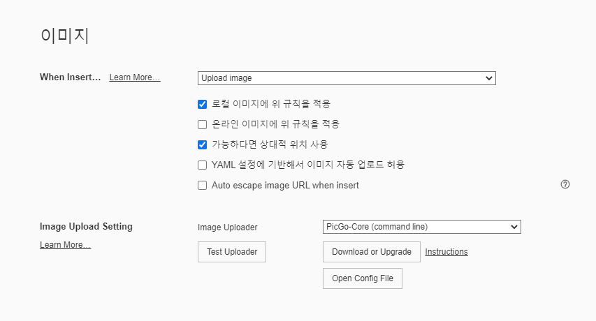
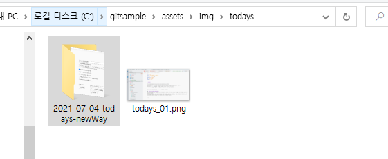

# typora사용하니까 쉽다

저번 글에서 마크다운 쓰기 싫다고ㅋㅋㅋ찡찡대던 나인데, 역시 불편하면 방법을 찾아내고야 만다.

typora를 다운 받으면 notion처럼 눈에 실시간으로 보면서 글을 쓰고, 무엇보다 이미지 넣기가 너무 편하다.

메타데이터에 다음처럼 추가해주고

> typora-copy-images-to: ..\..\assets\img\todays

다음처럼 설정!

요렇게 파일에 자동으로 복사되서 들어간다. 스샷해서 바로 붙여넣을 때 _개꿀띠_

편해졌다!!

